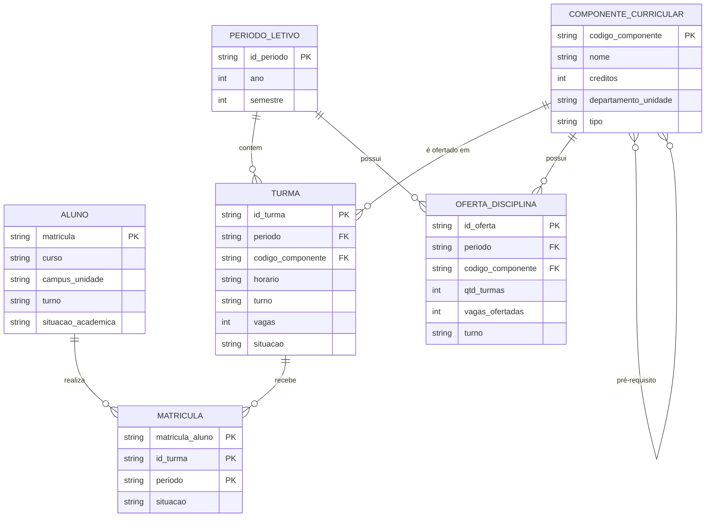

# Modelo de dados

O domínio tem muitas relações entre entidades (aluno, turma, disciplina, período) e as
consultas dependem de **junções e agregações**. Por isso, todas as entidades usam o
**modelo relacional**, normalizado — exceto o *Indicador de Demanda*, desnormalizado de propósito.

!!! note "Modelo de planejamento"
    Entidades, atributos e chaves foram transcritos da aba *3 Modelos*. Ainda não há dicionário físico validado. Em especial, a origem do vínculo **aluno–turma** precisa ser comprovada antes de implementar Matrícula e calcular ocupação.

## Diagrama conceitual

!!! note "Sobre o diagrama"
    É um diagrama **conceitual**, derivado das entidades e relacionamentos descritos
    abaixo. O *Indicador de Demanda* fica fora do diagrama por ser uma estrutura derivada
    (calculada a partir de Turmas, Matrículas e Componentes).

## Entidades

| Entidade | O que representa | Chave | Normalização |
|---|---|---|---|
| **Aluno** | Pessoa matriculada em um curso da UnB | `matrícula` | Normalizado |
| **Componente Curricular** | Disciplina ou componente oferecido pela UnB | `código_componente` | Normalizado |
| **Turma** | Oferta específica de um componente em determinado período | `id_turma` / código da turma | Normalizado |
| **Matrícula** | Relação entre um aluno e uma turma em um período | `matrícula_aluno + id_turma + período` | Normalizado |
| **Período Letivo** | Semestre em que as turmas são ofertadas | `id_período` | Normalizado |
| **Oferta de Disciplina** | Turmas e vagas disponibilizadas para um componente em um período | `id_oferta` / componente + período | Normalizado |
| **Indicador de Demanda** | Métricas de apoio à decisão de oferta | `id_indicador` / componente + período + turno | **Desnormalizado** |

### Detalhes por entidade

??? info "Aluno"
    - **Atributos principais:** matrícula, curso, campus/unidade, turno, situação acadêmica.
    - **Relacionamentos:** pertence a um curso; pode estar relacionado a várias disciplinas/turmas.
    - **Modelos descartados:** documento, chave-valor.
    - **Justificativa:** atributos estruturados que precisam ser relacionados a outras entidades; o modelo relacional facilita filtros, agregações e cruzamentos sem duplicar informação.

??? info "Componente Curricular"
    - **Atributos principais:** código, nome, créditos, departamento/unidade, tipo, pré-requisitos.
    - **Relacionamentos:** pode ter várias turmas; pode ter relação de pré-requisito com outros componentes.
    - **Modelos descartados:** documento, chave-valor, grafo.
    - **Justificativa:** é uma entidade de referência usada por várias turmas; mantê-la separada evita duplicação e garante consistência.

??? info "Turma"
    - **Atributos principais:** código da turma, período, código do componente, horário, turno, vagas, situação.
    - **Relacionamentos:** pertence a um componente curricular; pode ter alunos matriculados.
    - **Modelos descartados:** documento, chave-valor.
    - **Justificativa:** relações claras com disciplinas e alunos; consultada por período, disciplina e turno.

??? info "Matrícula"
    - **Atributos principais:** matrícula do aluno, id da turma, período, situação.
    - **Relacionamentos:** relaciona um Aluno a uma Turma.
    - **Modelos descartados:** documento, chave-valor.
    - **Justificativa:** entidade associativa (muitos-para-muitos) que permite consultar a demanda por disciplina e turma.

??? info "Período Letivo"
    - **Atributos principais:** código/período, ano, semestre.
    - **Relacionamentos:** possui várias turmas e matrículas.
    - **Modelos descartados:** documento, chave-valor.
    - **Justificativa:** permite comparar oferta e demanda ao longo dos semestres e identificar tendências.

??? info "Oferta de Disciplina"
    - **Atributos principais:** período, componente, quantidade de turmas, vagas ofertadas, turno.
    - **Relacionamentos:** relaciona um componente curricular a um período e às suas turmas.
    - **Modelos descartados:** documento, chave-valor, série temporal.
    - **Justificativa:** informação estruturada que precisa se relacionar à disciplina e ao período; facilita comparações históricas e consultas por turno.

??? info "Indicador de Demanda"
    - **Atributos principais:** período, componente, demanda, vagas, taxa de ocupação, número de turmas, turno.
    - **Relacionamentos:** baseia-se em Turmas, Matrículas e Componentes Curriculares.
    - **Modelos descartados:** série temporal, documento.
    - **Normalização:** **desnormalizado** — estrutura voltada à consulta e à análise. Manter os indicadores consolidados evita recalcular agregações complexas a cada consulta.

## Pontos de modelagem a validar

| Ponto | Questão a resolver |
|---|---|
| Aluno e vínculo acadêmico | Confirmar se a chave identifica uma pessoa ou um vínculo com um curso e como mudanças de curso são representadas |
| Matrícula | Identificar a fonte do relacionamento aluno–turma e validar a chave composta; não inferir matrículas só pela oferta de turmas |
| Oferta de Disciplina | A chave da planilha omite turno, embora ele seja atributo. Definir se a granularidade será componente + período + turno |
| Oferta e indicadores | Quantidade de turmas e vagas são agregações; definir se Oferta será tabela, visão ou resultado calculado |
| Pré-requisitos | A relação entre componentes pode exigir uma associação própria; validar regras e representação na fonte |
| Curso e matriz | Confirmar a relação componente–curso para distinguir obrigatórias de optativas e comparar turnos |
| Trajetórias | O modelo atual não detalha datas de conclusão, coortes e modalidades de ingresso, embora façam parte dos objetivos |

Essas questões complementam o desenho original e devem ser resolvidas durante o [perfilamento e validação](../projeto/plano-de-validacao.md).

## Regra de ouro

> O modelo certo é aquele em que a consulta **mais frequente** é a mais simples de escrever.

As consultas mais frequentes do projeto estão listadas na
[visão geral](../projeto/visao-geral.md#perguntas-que-o-sistema-precisa-responder).
