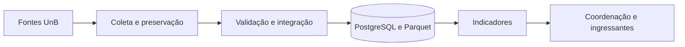

---
hide:
  - toc
---

# Trajetórias Acadêmicas UnB

BD2 · FCTE/UnB · 2026.2

## Dados para compreender trajetórias e planejar a oferta acadêmica

Integramos o planejamento de dados de **alunos, turmas e componentes curriculares** para apoiar a coordenação dos cursos e ajudar futuros ingressantes a conhecer a realidade da UnB.

[Conheça o projeto](projeto/visao-geral.md){ .md-button .md-button--primary }
[Explore a arquitetura](projeto/arquitetura.md){ .md-button }

- **3 fontes**

    Alunos, turmas e componentes curriculares.

- **7 entidades**

    Modelo conceitual orientado às consultas.

- **8 etapas**

    Da coleta ao consumo dos indicadores.

- **1 decisão proposta**

    PostgreSQL e Parquet, a validar com dados reais.

!!! info "Estágio do projeto: planejamento e validação"
    Esta documentação consolida a planilha da equipe, versão 1.0. As tecnologias e o pipeline estão **propostos**; volumes, disponibilidade dos campos e resultados de desempenho ainda precisam ser medidos. Consulte a [origem do conteúdo](referencia/planilha.md) e o [plano de validação](projeto/plano-de-validacao.md).

## Duas perspectivas, uma base de dados

- :material-chart-box-outline: **Para a coordenação acadêmica**

    ---

    Comparar oferta de turmas, distribuição por turno e possíveis gargalos para apoiar o planejamento semestral.

    [Perguntas e indicadores](projeto/indicadores.md)

- :material-school-outline: **Para futuros ingressantes**

    ---

    Entender tempo de formação, conclusão e formas de ingresso por meio de informações agregadas dos cursos.

    [Objetivos e escopo](projeto/visao-geral.md)

## Explore a documentação

- :material-database-outline: **Dados e modelagem**

    ---

    Conheça a origem dos dados, os formatos e os relacionamentos que sustentam as análises.

    [Fontes](dados/fontes.md) · [Formatos](dados/formatos.md) · [Modelo](dados/modelo-de-dados.md)

- :material-transit-connection-variant: **Pipeline e qualidade**

    ---

    Acompanhe a coleta, a integração e os critérios propostos para publicar indicadores consistentes.

    [Fluxo](pipeline/visao-geral.md) · [Etapas](pipeline/etapas.md) · [Qualidade](pipeline/qualidade.md)

- :material-source-branch: **Decisões de engenharia**

    ---

    Entenda os critérios de escolha de PostgreSQL e Parquet, as alternativas e os riscos aceitos.

    [ADR-001](decisoes/adr-001-postgresql-parquet.md) · [Cargas e engines](dados/cargas-e-engines.md)

- :material-clipboard-check-outline: **Próximas entregas**

    ---

    Veja quais evidências faltam para validar a arquitetura e orientar a implementação.

    [Plano de validação](projeto/plano-de-validacao.md) · [Pendências](pendencias.md)

## Do dado ao apoio à decisão

Fluxo planejado; a divisão entre os armazenamentos está descrita na [arquitetura proposta](projeto/arquitetura.md).

## Equipe

Ana Joyce · Gustavo Alves · Gabriel Lima da Silva · Nathan Abreu · Guilherme Evangelista · Angélica · Davi Araújo

*Sistemas de Banco de Dados 2 · Turma 3 · 2026.2 · FCTE/UnB.*
