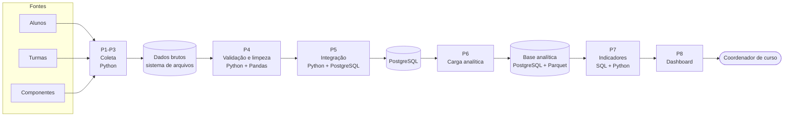

# Pipeline de dados — visão geral

O pipeline leva o dado da **fonte** ao **consumo**:
fonte → ingestão → armazenamento → transformação → consumo.

## Fluxo

!!! note "Fluxo planejado"
    O diagrama representa a proposta da planilha. P1–P7 processam dados em lote; P8 atende consultas sob demanda. O público externo está previsto na identificação do projeto, embora a etapa de consumo da planilha mencione apenas o coordenador. A [arquitetura proposta](../projeto/arquitetura.md) detalha essa extensão.

## Princípios

1. **Lote, não tempo real.** A oferta de disciplinas é decidida por semestre; um atraso de 1 hora tem custo baixo em quase todas as etapas.
2. **Preservar o dado bruto.** Os arquivos originais são guardados sem alteração, para permitir auditoria e reprocessamento.
3. **Validar na entrada.** Cada coleta confere formato, tamanho, colunas e integridade antes de seguir adiante.
4. **Documentar cada transformação.** Cada transformação é uma decisão de negócio disfarçada de código.
5. **Só migrar para contínuo com motivo.** A equipe só considera processamento contínuo se alguém souber dizer quanto custa o atraso.

## ETL ou ELT?

| Etapa | Modo |
|---|---|
| Coleta (P1–P3) | **ELT** — carrega o dado bruto antes de transformar |
| Validação, limpeza e integração (P4–P5) | **ETL** |
| Carga analítica e indicadores (P6–P7) | **ELT** |
| Consumo (P8) | Não se aplica |

As classificações ETL/ELT acima reproduzem a planilha. Na implementação, será necessário confirmar onde as transformações de P6 e P7 acontecem: antes ou depois da carga no destino.

## Onde cada etapa está detalhada

Veja a página [Etapas](etapas.md), os critérios de [Qualidade e reprocessamento](qualidade.md) e os [Riscos](riscos.md) do pipeline.
