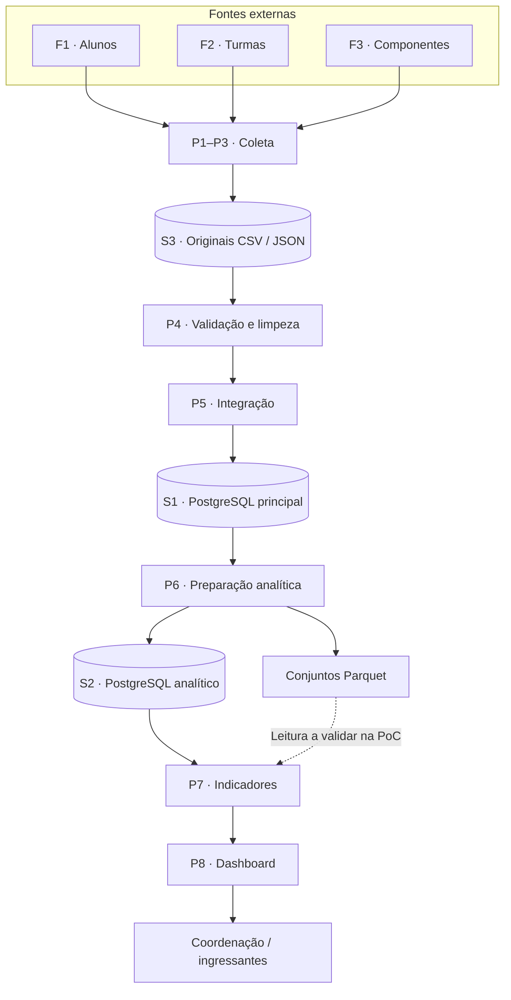

# Arquitetura proposta

A planilha propõe **PostgreSQL** para os relacionamentos e consultas SQL, **Parquet** para conjuntos analíticos e **Python** para coleta e transformação. O processamento acompanha as atualizações das fontes, em lote.

!!! note "Proposta de organização"
    A separação abaixo concilia os blocos da planilha e explicita pontos ainda abertos. Não representa infraestrutura implantada nem altera o status **proposto** do [ADR-001](../decisoes/adr-001-postgresql-parquet.md).

## Camadas e responsabilidades

| Camada | Responsabilidade | Critério de saída proposto |
|---|---|---|
| Bruta — S3 | Preservar o arquivo recebido e sua identificação de origem | Download íntegro, versão e data da coleta registradas |
| Tratamento — P4 | Padronizar tipos, identificar duplicatas e separar inconsistências | Relatório de qualidade por fonte |
| Integrada — S1 | Representar as entidades e preservar vínculos validados | Chaves e relacionamentos verificados |
| Analítica — S2 e Parquet | Preparar recortes e agregações para as perguntas do projeto | Indicadores conciliados com os dados de entrada |
| Consumo — P8 | Apresentar filtros, resultados e atualização dos dados | Exibir somente uma versão validada da carga |

## PostgreSQL e Parquet: divisão proposta

**PostgreSQL principal (S1)** mantém os dados integrados e suas restrições. A aba 4 o classifica como OLTP; a carga real ainda precisa ser avaliada, pois o pipeline descrito é predominantemente em lote.

**PostgreSQL analítico (S2)** é o destino proposto para tabelas ou visões usadas pelo dashboard. A separação é lógica neste desenho: schemas, bancos ou instâncias separados ainda precisam ser escolhidos conforme a prova de conceito e os recursos disponíveis.

**Parquet** armazena conjuntos tratados e exportações analíticas para processamento em Python e comparação de desempenho. O leitor e as consultas que acessarão esses arquivos diretamente ainda estão a definir. O formato, por si só, não define o serviço de consulta.

## Preservação dos dados brutos

O bloco de cargas e as etapas de coleta pedem preservação dos originais; o texto do ADR também menciona brutos em Parquet. A proposta desta documentação é **manter o original em CSV/JSON e produzir Parquet como derivado**, permitindo repetir a transformação. Esse alinhamento precisa ser confirmado pela equipe antes da aceitação do ADR.

## Atualização e falhas

Uma nova coleta deve gerar uma versão identificável dos dados. As validações de P4–P7 precedem a disponibilização ao dashboard. Se uma execução falhar, a proposta é manter a última versão validada e informar sua data, em vez de expor uma carga parcial.

Os controles estão em [Qualidade e reprocessamento](../pipeline/qualidade.md). As metas de latência da planilha estão em [Cargas e engines](../dados/cargas-e-engines.md) e ainda não são resultados medidos.
